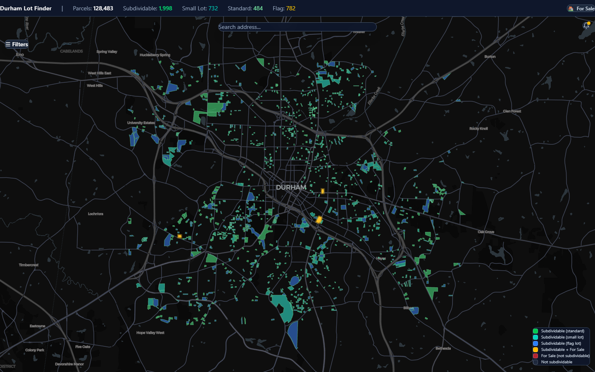
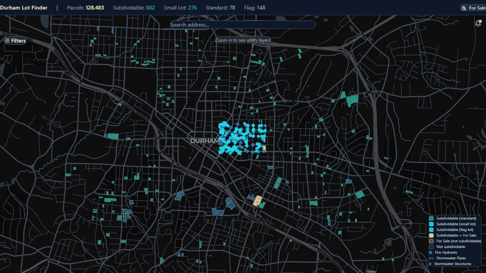
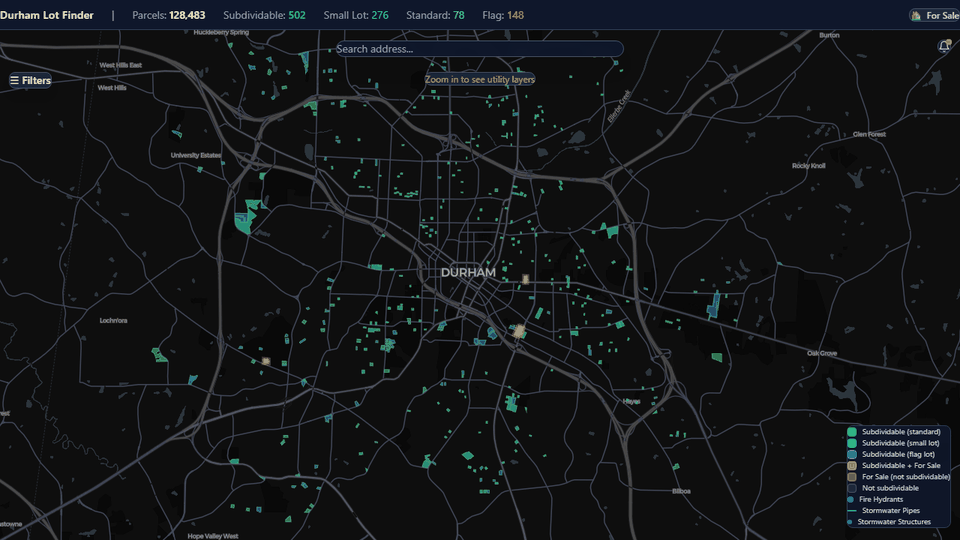
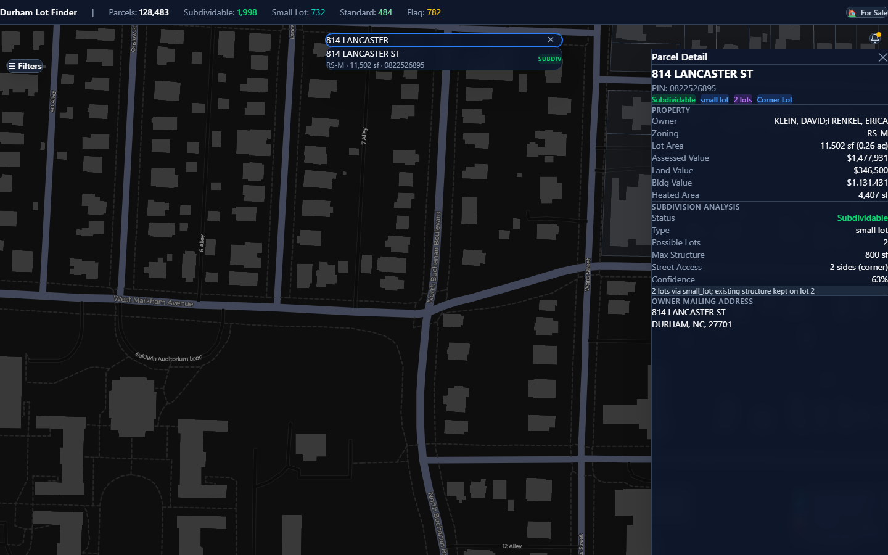
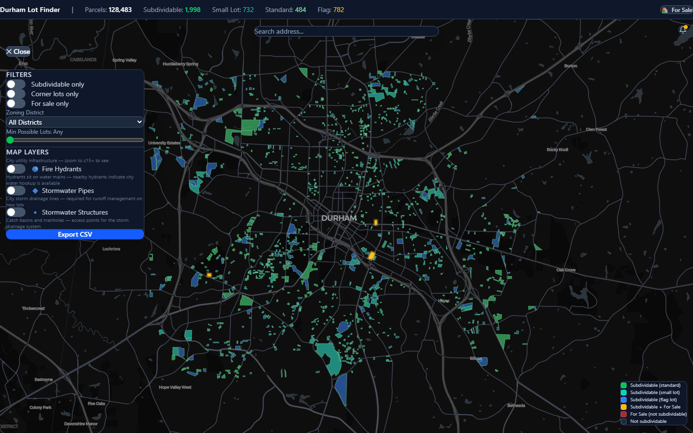
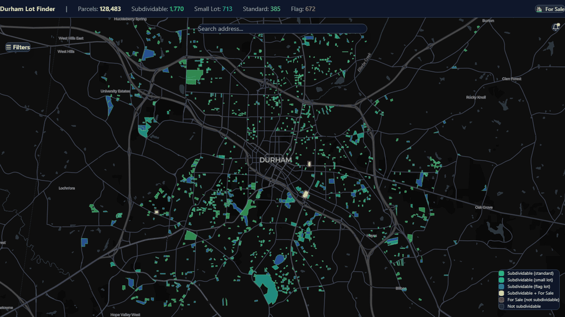

# Durham Subdividable Lots Finder

An automated geospatial analysis tool that evaluates every residential lot in Durham, NC for legal subdivision potential under the city's [Unified Development Ordinance (UDO)](https://udo.durhamnc.gov). For viable lots, it algorithmically proposes new lot lines and structure footprints, then displays everything on a GPU-accelerated interactive map.



## The Problem

Durham's residential zoning allows many existing lots to be legally subdivided — but finding them requires manually cross-referencing lot dimensions, zoning district rules, setback requirements, and building footprints for each of the city's 128,000+ parcels. Real estate investors and developers spend hours on this per lot.

This tool automates the entire process: it ingests public parcel data, applies UDO zoning rules, runs geometric subdivision analysis, and surfaces actionable results through a map interface — turning weeks of manual research into a 45-minute batch job.

## What It Does

Zoom in from the city-wide view to explore subdivision potential on any lot:



Search for a specific address and instantly see the full analysis:



### Analysis Pipeline

- **128,483 parcels** ingested from Durham's ArcGIS open data portal with full geometry, ownership, and assessment data
- **UDO rules engine** encodes dimensional standards for every residential zoning district (RS-20, RS-10, RS-8, RS-M, RU-5, RU-M, etc.) including setbacks, minimum lot sizes, and the small lot option
- **Quick filter** classifies all parcels by area vs. zoning minimums, with street frontage checks, owner exclusions (government, institutional), and land class filtering
- **Geometric subdivision** attempts standard splits, small lot splits, and flag lot configurations — trying multiple split positions and scoring by conformance
- **Structure fitting** verifies that a minimum viable structure (600–800 sf footprint) fits within setback-buffered buildable envelopes on each proposed lot
- **Primary structure preservation** ensures existing homes aren't bisected by proposed lot lines; split lines are shifted around exclusion zones
- **Parallel batch processing** with 8 workers handles ~370 parcels/min across the full dataset

### How the Subdivision Algorithm Works

For each parcel, the system tries to maximize the number of conforming lots, in priority order:

1. **Small lot option first** (2,000 sf minimum, 25 ft width) — available in most urban/suburban districts. Tries N lots, then N-1, N-2, etc. until a valid configuration is found.
2. **Standard subdivision** — uses the district's conventional minimums (e.g., 10,000 sf for RS-10). Same descending-N approach.
3. **Flag lot** — for interior lots without enough frontage for a standard split. Carves a 20 ft "pole" from the street to a rear lot.

For each attempt, the algorithm:
- **Detects street frontage** by analyzing which edges of the parcel polygon adjoin streets (via spatial adjacency to road geometry)
- **Draws split lines perpendicular to the street** so every resulting lot retains a strip of frontage
- **Tries multiple split positions** with small offsets (±3%, ±7%, ±12%) to find configurations that avoid existing structures
- **Validates each lot** against the zoning district's minimum area, minimum width, and setback requirements
- **Computes the buildable envelope** (lot minus street/side/rear setbacks) and verifies a minimum structure footprint fits inside
- **Scores candidates** by total buildable area and picks the best valid configuration

For corner lots, the algorithm tries splits along both street directions and keeps whichever yields more conforming lots.

### Results

| Metric | Count |
|--------|-------|
| Total parcels analyzed | 128,483 |
| Classified as subdividable | 21,501 |
| With full geometric analysis + proposed geometry | 4,965 |
| — Small lot subdivisions | 2,181 |
| — Flag lot subdivisions | 1,577 |
| — Standard subdivisions | 1,207 |
| Existing structure conflicts | 2,655 |
| Excluded (government/institutional owners) | 2,297 |

## Features

### Interactive Map

- **GPU-accelerated rendering** of 128k+ parcel polygons at 60fps via deck.gl
- **Color-coded parcels** — green (standard), teal (small lot), blue (flag lot), gold (for sale + subdividable), red (for sale only), grey (not subdividable)
- **Proposed lot lines** rendered as distinct colored polygons when a subdividable parcel is selected
- **Proposed structure footprints** shown in orange within buildable envelopes
- **Dark theme** with CARTO basemap tiles (no API key required)
- **Map legend** for quick reference

### Parcel Detail Panel

- Full property info: address, owner, zoning, lot area, assessed value, heated area
- Subdivision analysis results: type, possible lots, max structure size, confidence score
- Street access classification (corner lot vs. interior)
- Owner mailing address (for direct mail campaigns)
- Address fallback when site address is missing



### Filtering & Search

- **Address search** with autocomplete, fly-to on selection, and subdividable badges on results
- **Subdividable only** toggle
- **Corner lots only** filter
- **For sale only** filter
- **Zoning district** dropdown
- **Minimum possible lots** slider
- **CSV export** with owner mailing info for direct mail campaigns



### Redfin "For Sale" Integration

- Automated daily listing scrape via Redfin's Stingray API with polygon-based search
- Spatial join matches listings to parcel polygons via PostGIS `ST_Contains`
- **Gold highlighting** on the map for subdividable lots currently for sale
- **Browseable "For Sale Now" panel** with listing cards, photos, prices, and direct Redfin links
- Prev/Next navigation that flies the map to each listing
- Tab filtering: All vs. Subdividable listings
- Rich tooltips with listing photos, price, and bedroom/bath count



### Utility Infrastructure Layers

- Fire hydrants, stormwater pipes, and stormwater structures toggle layers
- Zoom-level gated (z15+) to avoid visual clutter
- Helpful for assessing hookup feasibility on vacant lots

### Other

- **Mobile responsive** — bottom sheet for detail panel, full-screen filter drawer, collapsible stats bar
- **Notification bell** (UI demo) — subscribe-to-alerts interface for new subdividable listings

## Architecture

```
┌──────────────────────────────────────────────────────────────┐
│           Frontend — React + TypeScript + Vite                │
│  ┌──────────────┐  ┌──────────────┐  ┌───────────────────┐   │
│  │  deck.gl +   │  │  Filter &    │  │  Parcel Detail &  │   │
│  │  MapLibre GL │  │  Search UI   │  │  For Sale Panel   │   │
│  └──────────────┘  └──────────────┘  └───────────────────┘   │
└───────────────────────────┬──────────────────────────────────┘
                            │ REST / GeoJSON
┌───────────────────────────▼──────────────────────────────────┐
│                Backend — Python + FastAPI                      │
│  ┌──────────────┐  ┌──────────────┐  ┌───────────────────┐   │
│  │  API Routes  │  │  Analysis    │  │  UDO Rules        │   │
│  │  (GeoJSON,   │  │  Pipeline    │  │  Engine           │   │
│  │   Stats,     │  │  (Batch +    │  │  (udo_rules.json) │   │
│  │   Export)    │  │   Parallel)  │  │                   │   │
│  └──────────────┘  └──────────────┘  └───────────────────┘   │
└───────┬───────────────────┬──────────────────────────────────┘
        │                   │
┌───────▼────────┐  ┌───────▼────────────────────────────────┐
│  PostgreSQL +  │  │  Data Ingestion                         │
│  PostGIS       │  │  ┌─────────┐ ┌──────────┐ ┌─────────┐ │
│  (Docker)      │  │  │ Parcels │ │ Buildings│ │ Redfin  │ │
│                │  │  │ ArcGIS  │ │ NC SDD   │ │ Stingray│ │
│  128k parcels  │  │  └─────────┘ └──────────┘ └─────────┘ │
│  135k footprts │  │  ┌─────────┐ ┌──────────┐             │
│  2.5k zoning   │  │  │ Zoning  │ │ Streets  │             │
│  Analysis      │  │  │ ArcGIS  │ │ OSM      │             │
│  Listings      │  │  └─────────┘ └──────────┘             │
└────────────────┘  └────────────────────────────────────────┘
```

### Key Architectural Decisions

**PostGIS for spatial operations** — All geometry is stored in both EPSG:4326 (WGS84, for display) and EPSG:2264 (NC State Plane in feet, for area/distance calculations). Spatial indexes on parcel and building footprint geometry enable fast bbox queries. The API uses raw SQL rather than an ORM for GeoJSON endpoints — this matters when serializing 128k+ features.

**deck.gl + MapLibre GL JS for rendering** — Needed to render 128k+ polygons at interactive frame rates. deck.gl's GeoJsonLayer handles this on the GPU without tiling or simplification. MapLibre GL JS provides the basemap with no API key requirement (vs. Mapbox which requires a token). The entire map stack is open source.

**Parallel batch processing with ProcessPoolExecutor** — The geometric analysis is CPU-bound (Shapely polygon operations). Workers receive only parcel IDs rather than serialized geometry — each opens its own database connection and loads geometry locally. This avoids WKB serialization issues on Windows and keeps memory usage predictable.

**UDO rules as data, not code** — All zoning dimensional standards live in `udo_rules.json`, hand-verified against Durham's UDO. The rules engine looks up values by district code rather than encoding them in if/else chains. This makes it straightforward to update when the UDO changes (Durham is rewriting theirs) or extend to other jurisdictions.

**Viewport-based data fetching** — The frontend requests GeoJSON by bounding box with debouncing, so only visible parcels are transmitted. This keeps initial load fast and enables smooth panning without loading the entire 128k feature dataset upfront.

**Docker Compose for infrastructure** — PostgreSQL + PostGIS runs in a container, and a separate cron container handles daily Redfin listing refreshes. The application code runs natively (Python venv + Node) for faster development iteration.

**Subdivision algorithm priority** — The system tries small lot option first (2,000 sf minimum, fits in more districts), then standard subdivision, then flag lot. This maximizes the number of possible lots per parcel, which is the metric that matters for investment analysis.

## Tech Stack

| Layer | Technology |
|-------|-----------|
| Frontend | React 18, TypeScript, Vite |
| Map Rendering | deck.gl, MapLibre GL JS |
| Styling | Tailwind CSS |
| Backend | Python 3.11, FastAPI |
| Geometry | Shapely, GeoPandas |
| Database | PostgreSQL 16 + PostGIS 3.4 |
| Data Ingestion | GDAL/OGR, ArcGIS REST API, Redfin Stingray API |
| Infrastructure | Docker Compose |

## Data Sources

- **Parcels** — [Durham Open Data Portal](https://services2.arcgis.com/G5vR3cOjh6g2Ed8E/arcgis/rest/services/Parcels_NEW/FeatureServer/0) (ArcGIS FeatureServer, 128k+ records)
- **Zoning Districts** — [Durham Zoning](https://live-durhamnc.opendata.arcgis.com/datasets/zoning-1) (ArcGIS)
- **Building Footprints** — [NC Emergency Management](https://sdd.nc.gov) (File Geodatabase by county)
- **UDO Rules** — [Durham UDO](https://udo.durhamnc.gov) (hand-verified dimensional standards)
- **For-Sale Listings** — Redfin Stingray API (polygon search, refreshed daily)
- **Utility Infrastructure** — Durham ArcGIS REST services (fire hydrants, stormwater)

## Running Locally

```bash
# Copy env template and set a database password
cp .env.example .env  # then edit POSTGRES_PASSWORD and the DB URLs

# Start database
docker compose up -d

# Backend API
source .venv/Scripts/activate
python -u -m uvicorn backend.main:app --port 8000 --host 0.0.0.0

# Frontend
cd frontend && npm run dev
```

### Analysis Pipeline

```bash
# 1. Street access analysis (~70 sec)
python -u -m backend.analysis.street_access

# 2. Quick filter — area + zoning + ownership (~2.5 min)
python -u -m backend.analysis.quick_filter

# 3. Geometric analysis — parallel, 8 workers (~45 min)
python -u -m backend.analysis.batch_processor

# 4. Redfin listings (~1-2 min)
python -u -m backend.ingestion.fetch_listings
```

## License

[CC BY-NC 4.0](LICENSE) — free to share and adapt for non-commercial use with attribution.
